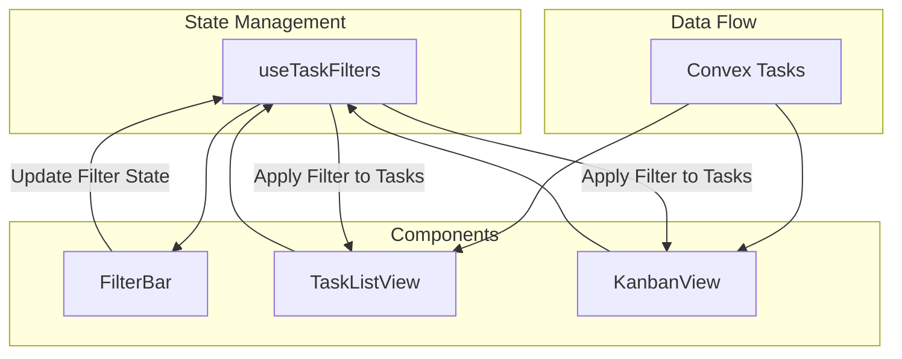

# Milestone 8: Filter Bar

The goal of this milestone is to add a shared filtering capability to both the `TaskListView` and `KanbanView`. This will be implemented using a reusable hook and a shared `FilterBar` component.

## Architecture

## Implementation Details

### 1. `hooks/useTaskFilters.ts`

This hook will manage the state of filters using React's `useState`. It will handle:

- **Status Filter**: Multi-select (`todo`, `in_progress`, `done`).
- **Criticity Filter**: Multi-select (`low`, `medium`, `high`).
- **Due Date Filter**: Presets (`all`, `overdue`, `today`, `next_7_days`).
- **Filter Logic**: A `filterTasks` function that takes a task array and returns the filtered version.

### 2. `components/tasks/FilterBar.tsx`

The UI component will provide:

- **Status Select**: A multi-select dropdown or set of pill toggles.
- **Criticity Select**: A multi-select dropdown or set of pill toggles.
- **Due Date Select**: A dropdown for presets.
- **Clear Filters**: A button to reset all filters to their default states.

### 3. Integration

- `**TaskListView.tsx`**:
  - Render `FilterBar` above the task table.
  - Use `useTaskFilters` to get the current filter state and filtering logic.
  - Filter the tasks array before rendering.
  - Handle the "No tasks match" empty state.
- `**KanbanView.tsx`**:
  - Render `FilterBar` above the board.
  - Filter the tasks array before grouping them into columns.
  - If a column becomes empty due to filtering, it should remain visible but show an empty state.

## Key Files to Create/Update

- `[hooks/useTaskFilters.ts](hooks/useTaskFilters.ts)` (New)
- `[components/tasks/FilterBar.tsx](components/tasks/FilterBar.tsx)` (New)
- `[components/tasks/TaskListView.tsx](components/tasks/TaskListView.tsx)` (Update)
- `[components/tasks/KanbanView.tsx](components/tasks/KanbanView.tsx)` (Update)

